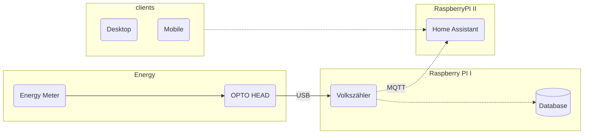

# Setup Volkszähler on a RasPI
In order to connect my energy meter to my Homeassistant installation I had to figure out a way to get the data off the meter and into the system. There are a couple of option

1. Get a real smart meter that offers some form of API or cloud service that you can use
2. Pull the information from the optical gateway that sends the data in the SML format
3. count the number of impulses on the interface

In my case I went with option 2 but I will also have a writeup for option 3 with the use of ESPHome soon

Energy Monitoring comes with a lot of different aspects. This Repo is aimed to provied an easy to follow guide on how to setup [Volkszähler](https://www.volkszaehler.org/) on a Raspberry PI. This will be split into the following sections

* Technical Setup
* Usage of Energy Data
* and everything else that might be important

## Connection Diagramm



## Used Hardware 
* [Optokopf](https://shop.weidmann-elektronik.de/index.php?page=product&info=24)
* Raspberry PI 4 
* DIN Rail
* 5V Energy Supply 


## Technical Setup

To collect the information from the meter I have connected a [Optokopf](https://shop.weidmann-elektronik.de/index.php?page=product&info=24) to the optical output of the meter. 


Since I wanted everything to be housed within the breaker box I added a 5V power supply and a DIN Rail case for the Raspberry


## Setup VZLOGGER (Not needed when using the RaspberryPi Image)

Install needed stuff 
````
sudo apt-get install build-essential git-core cmake pkg-config subversion libcurl4-openssl-dev libgnutls28-dev libsasl2-dev uuid-dev libtool libssl-dev libgcrypt20-dev libmicrohttpd-dev libltdl-dev libjson-c-dev libleptonica-dev libmosquitto-dev libunistring-dev dh-autoreconf
````

Download vzlogger
````
git clone https://github.com/volkszaehler/vzlogger.git
cd vzlogger
./install.sh

````

### Test serial port connection to smart meter
Setup serial port to check the connection 

``` console
stty -F /dev/ttyUSB0 9600 -parenb cs8 -cstopb -ixoff -crtscts -hupcl -ixon -opost -onlcr -isig -icanon -iexten -echo -echoe -echoctl -echoke
```

Test output from serial 
``` console
cat /dev/ttyUSB0
```

If the data looks unreadable, your meter returns the data in the SML Format

## 📈 Volkszähler

### Installation

To collect the usage information via the optical gateway and translate the SML data into something useable I went ahead and setup [Volkszähler](https://wiki.volkszaehler.org/howto/raspberry_pi_image) on an old RasPi. After you have installed the image it is time to start he configuration 

### Checking for Data
To see if and what information is send from the smart meter we will open up a shell into the raspberry and start configuration of **vzlogger**

````shell
sudo nano /etc/vzlogger.conf
````

and enter the following basic configuration. You can also make use of the [vzlogger.conf Editor](http://volkszaehler.github.io/vzlogger/)

````shell
{
"retry" : 0,                    /* sleep between failed requests (seconds) */
"daemon": true,                 /* run as deamon*/
"verbosity" : 15,               /* Loglevel between 0 (nothing) and 15 (higest) */
"log" : "/var/log/vzlogger.log",/* logfile path */

"local" : {
        "enabled" : false,      /* Enable / Disable local HTTP-Server for serving live readings */
        "port" : 80,          /* TCP port for the local HTTP-Server */
        "index" : true,         /* Provide a index listing of available channels */
        "timeout" : 30,         /* timeout for long polling requests (seconds) */
        "buffer" : 600          /* Buffer reading for the local interface (seconds) */
},

"meters" : [{
        "enabled" : true,           /* disable or enable meter */
        "protocol" : "sml",         /* use 'vzlogger -h' for available protocols */
        "device" : "/dev/ttyAMA0",  /* Serial Port of Photodiod */
        }
]}
````
now we need to restart vzlogger. I had to do this a couple of times 🤷‍♂️

````shell
sudo systemctl stop vzlogger
sudo systemctl start vzlogger
````
and then log the output to the console
````shell
tail -f /var/log/vzlogger.log
````
and you should see something that looks like this...

````shell
[Aug 12 15:23:55][mtr0] Got 4 new readings from meter:
[Aug 12 15:23:55][mtr0] Reading: id=1-0:1.8.0*255/ObisIdentifier:1-0:1.8.0*255 value=6864421.20 ts=1628774635968
[Aug 12 15:23:55][mtr0] Reading: id=1-0:1.8.1*255/ObisIdentifier:1-0:1.8.1*255 value=6864421.20 ts=1628774635968
[Aug 12 15:23:55][mtr0] Reading: id=1-0:1.8.2*255/ObisIdentifier:1-0:1.8.2*255 value=0.00 ts=1628774635968
[Aug 12 15:23:55][mtr0] Reading: id=1-0:16.7.0*255/ObisIdentifier:1-0:16.7.0*255 value=363.00 ts=1628774635968
````

Great! Now you can read your power consumption 👍.
But it still looks somewhat cryptic. What now?

Lets break down the information we can see. 

**[Aug 12 15:23:55]** -> Date of collected data

**[mtr0]** -> ID of the meter we have configured before

**Reading: id=1-0:1.8.0*255/ObisIdentifier:1-0:1.8.0*255 value=6864421.20 ts=1628774635968** -> OBIS ID, the collected value and the timestamp 

1-0:1.8.0*255 is the OBIS ID for the conusmed energy. See the [OBIS Reference](https://de.wikipedia.org/wiki/OBIS-Kennzahlen) for more details

### Channle configuration 

In order to use the data we have seen before we need to create a channle for each OBIS ID that we want to monitor

````shell
sudo nano /etc/vzlogger.conf
````

````shell
           "channels": [{
                "api": "volkszaehler",      // middleware api, default volkszaehler
                "uuid": "xxxxxxxxxxxxxxxxxxxxxxxxxxxxxxx", // Gesamt Bezug
                "middleware": "http://localhost/middleware.php",
                "identifier" : "1-0:1.8.0",    // Zählerstand
                "aggmode" : "max"
            },
````

The UUID you will need to create with the [middelware](https://wiki.volkszaehler.org/software/middleware/einrichtung#kanaele_im_frontend_anlegen)


## Using the Data

After you have finshed the configuration, open you browser and navigate back to your Volkszähler Url. This time you should see the usage data based on you configuration. 


# Debug Opions ⚠️

In case you run into any erros makre sure to run vzlogger in the shell to see all erros 

````
vzlogger -c /etc/vzlogger.conf
````

This is also mentioned on the Volkszähler homepage [Debug Volkszähler](https://wiki.volkszaehler.org/howto/debug)
